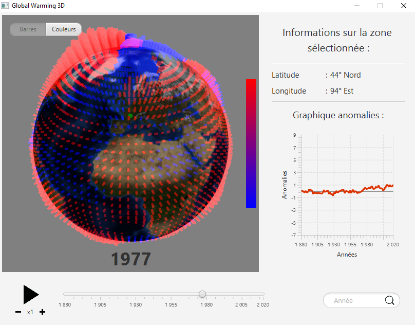

# global-warming-3d

HMI project - Polytech ET3 IT - Noted for S6 (2020)

## Objectives / Asked work

[Subject link](./Sujet_projetIHMJava2020.pdf)

All remaining bugs and unimplemented features are listed [here](https://github.com/adepreis/global-warming-3d/issues).

  

## Getting Started

These instructions will get you a copy of the project up and running on your local machine for development purpose.

### Prerequisites

Things you need to install the project :

- [Java 8 SE](https://www.java.com/fr/download/)

If you use a later JDK, be careful because JavaFX is decoupled from the JDK since the JDK 11.
You have to download it separately [here](https://gluonhq.com/products/javafx/).

- [JUnit 4](https://junit.org/junit4/) for testing purpose.

### Installing

Here are some instructions on how to get the development env running.

First, clone this repository with the following command :

`git clone https://github.com/adepreis/global-warming-3d`

Then create the Java project from `/src` folder using your favorite IDE.

Don't forget to include the [ObjModelImporterJFX library](http://www.interactivemesh.org/models/jfx3dimporter.html), the .jar file is located in `/libs`.

### Testing

Don't forget to include JUnit 4 (or later) library to the project.

The existing unit tests are classified by package in `/test`.

---

## Run the latest version

Execute the .jar file from the last [release assets](https://github.com/adepreis/global-warming-3d/releases/tag/0.1) as a standalone application using :

`java -jar global-warming-3d.jar`

---

## Documentation

In the `/doc` folder, you can find the project's Javadoc, the UML class diagram, the report and the wireframes/mockups of the interface.